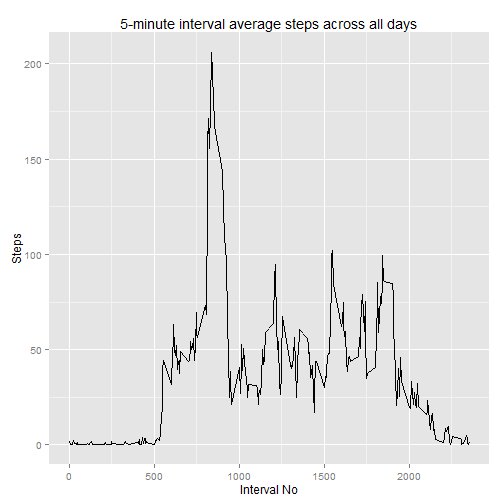

### 1. Introduction

It is now possible to collect a large amount of data about personal movement using activity monitoring devices such as a [Fitbit][1], [Nike Fuelband][2], or [Jawbone Up][3]. These type of devices are part of the “quantified self” movement – a group of enthusiasts who take measurements about themselves regularly to improve their health, to find patterns in their behavior, or because they are tech geeks. But these data remain under-utilized both because the raw data are hard to obtain and there is a lack of statistical methods and software for processing and interpreting the data.

[1]:http://www.fitbit.com/
[2]:http://www.nike.com/us/en_us/c/nikeplus-fuelband
[3]:https://jawbone.com/up

This assignment makes use of data from a personal activity monitoring device. This device collects data at 5 minute intervals through out the day. The data consists of two months of data from an anonymous individual collected during the months of October and November, 2012 and include the number of steps taken in 5 minute intervals each day.

### 2. Loading and preprocessing the data

```r
activity<-read.csv(unz("activity.zip", "activity.csv"))
```

### 3. What is mean total number of steps taken per day?

#### 3.1. Total number of steps taken each day

```r
suppressMessages(library(dplyr))
dailystat<-group_by(activity, date) %>%
    summarize(steps = sum(steps, na.rm=TRUE))
```

#### 3.2 Histogram of Total number of steps taken each day

```r
library(ggplot2)
ggplot(dailystat) +
    geom_histogram(aes(steps), alpha=.7, color="black", binwidth=(range(dailystat$steps)/8)[2], drop=T)+
    labs(title="Total number of steps taken distribution", x="Steps", y="Days")
```

 

#### 3.3 The mean and median of the total number of steps taken per day  

```r
dsmean<-sprintf("%.1f", mean(dailystat$steps))
dsmedian<-sprintf("%.1f", median(dailystat$steps))
```
Mean | Median
-----|-------
dsmean = 9354.2|dsmedian = 10395.0

### 4. What is the average daily activity pattern?

#### 4.1 Time series plot of the 5-minute interval and the average number of steps taken, averaged across all days

```r
suppressMessages(library(dplyr))
minutestat<-group_by(activity, interval)
minutestat<-summarize(minutestat, steps = mean(steps, na.rm=TRUE))
ggplot(minutestat, aes(x=interval, y=steps, group=1)) +
    geom_line() +
    labs(title="5-minute interval average steps across all days", x="Interval No", y="Steps")
```

 

#### 4.2 Which 5-minute interval, on average across all the days in the dataset, contains the maximum number of steps?

```r
maxsInterval<-filter(minutestat, steps==max(steps))
maxsInterval
```

```
## Source: local data frame [1 x 2]
## 
##   interval    steps
## 1      835 206.1698
```
*On average across all the day in the dataset, maxumum number of steps is contained in interval#835*

### 5 Imputing missing values

#### 5.1 Total number of missing values in the dataset (i.e. the total number of rows with NAs)

```r
sum(is.na(activity$step))
```

```
## [1] 2304
```

#### 5.2 Filling in missing data.  

_Devise a strategy for filling in all of the missing values in the dataset. The strategy does not need to be sophisticated. For example, you could use the mean/median for that day, or the mean for that 5-minute interval, etc. Create a new dataset that is equal to the original dataset but with the missing data filled in._

I chose to fill gaps with mean for that 5-minute interval for rest of days where it's known.

```r
imputedActivity<-group_by(activity, interval) %>%
    mutate(steps = ifelse(is.na(steps), mean(steps, na.rm = T), steps))
```
Quick check:

```r
nrow(filter(imputedActivity, is.na(steps)))
```

```
## [1] 0
```

#### 5.4 Histogram of the total number of steps taken each day

```r
imputedActivity<-group_by(activity, interval) %>% mutate(steps = ifelse(is.na(steps), mean(steps, na.rm = T), steps))
impDailyStat<-group_by(imputedActivity, date) %>% summarize(steps = sum(steps))

ggplot() +
    geom_histogram(data=dailystat, aes(steps, fill="g"), alpha=.1, color="blue", binwidth=(range(dailystat$steps)/8)[2], drop=T) +
    geom_histogram(data=impDailyStat, aes(steps, fill="b"), alpha=.5, binwidth=(range(impDailyStat$steps)/8)[2], drop=T)+
    scale_fill_manual(name="", values=c("g" = "green", "b"="black"), labels=c("g"="Raw Data", "b"="NAs filled in"))+
    theme(legend.position="bottom") +
    labs(title="Total number of steps taken distribution after gaps filled in", x="Steps", y="Days")
```

 

#### 5.5 Mean and median total number of steps taken per day.

```r
dsimean<-sprintf("%.1f", mean(impDailyStat$steps))
dsimedian<-sprintf("%.1f", median(impDailyStat$steps))
```
when| Mean | Median
----|------|-------
Before imputing|dsmean = 9354.2 | dsmedian = 10395.0
After imputing |dsimean = 10766.2 | dsimedian = 10766.2

#### 5.6 Do these values differ from the estimates from the first part of the assignment? What is the impact of imputing missing data on the estimates of the total daily number of steps?

As we can see on the histogram above, filling in gaps with mean value for the specific 5-minutes interval "normalised" the distribution. Expectedly, more days now report number of steps close to mean and median. Worth to mention, that mean and median  does not change dramatically, as originally calculated ignoring NA values, and then, those missed was filled in with mean value.

### 6. Are there differences in activity patterns between weekdays and weekends?
_Use the dataset with the filled-in missing values for this part. Create a new factor variable in the dataset with two levels – “weekday” and “weekend” indicating whether a given date is a weekday or weekend day. Make a panel plot containing a time series plot (i.e. type = "l") of the 5-minute interval (x-axis) and the average number of steps taken, averaged across all weekday days or weekend days (y-axis). See the README file in the GitHub repository to see an example of what this plot should look like using simulated data._


```r
wdStat<-mutate(imputedActivity, date=as.POSIXct(strptime(date, "%Y-%m-%d")))
wdStat<-mutate(wdStat, weekend=ifelse(weekdays(date) %in% c("Saturday","Sunday"), "Weekend", "Weekday"))
wdStat<-group_by(wdStat, interval, weekend)
wdStat<-summarize(wdStat, steps = mean(steps, na.rm=T))
ggplot(wdStat, aes(x=interval, y=steps, group=1)) +
    geom_line() +
    facet_grid(weekend ~ .) +
    labs(title="Weekday vs Weekend 5-minute interval average steps", x="Interval No", y="Steps")
```

 


